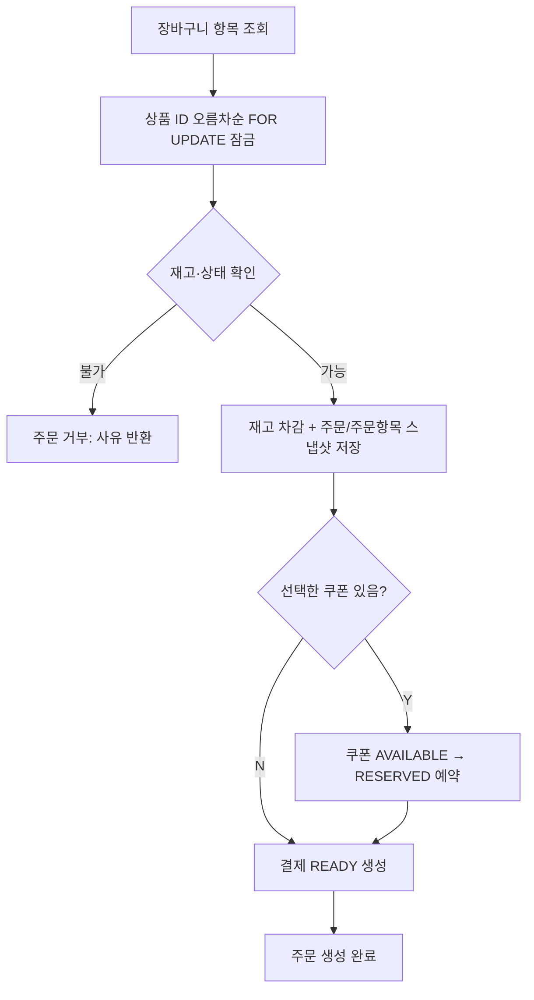
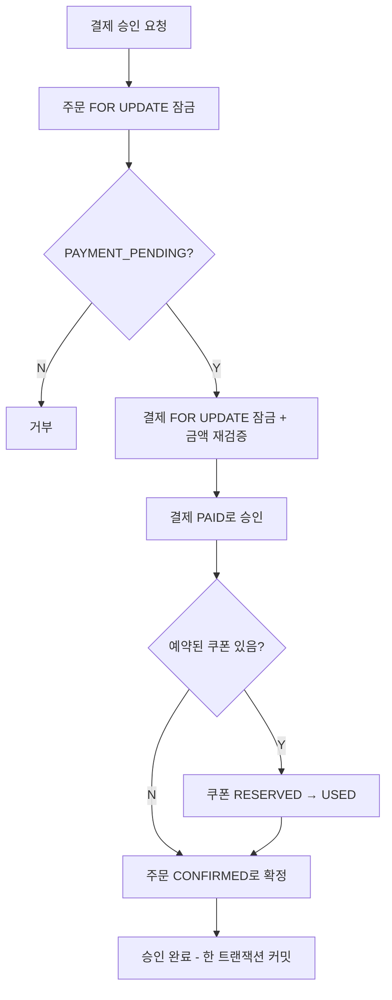
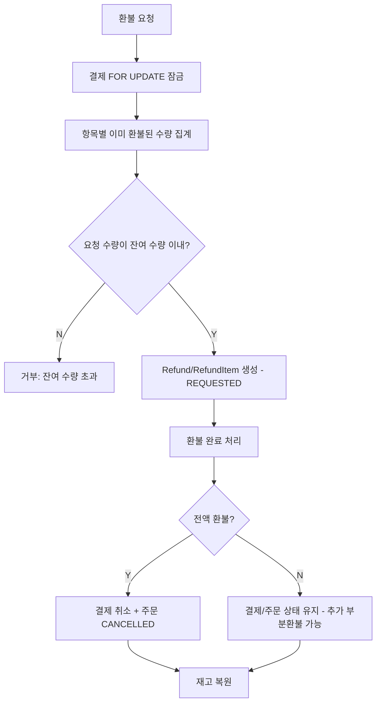
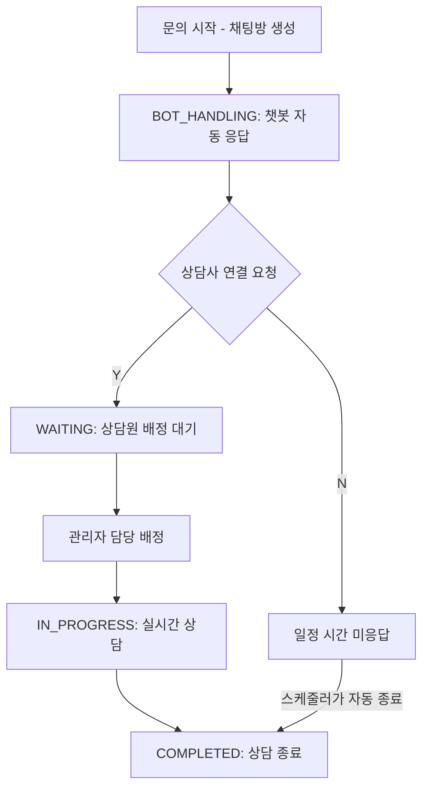
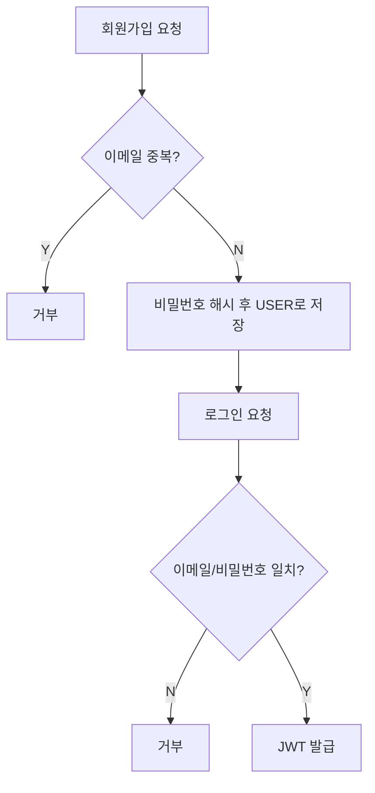

# 갈팡질팡 (Commerce)

Spring Boot / React 기반 커머스 플랫폼

회원이 상품을 조회하고 장바구니에 담아 주문·결제·환불까지 진행할 수 있고, 실시간 채팅으로 문의할 수 있는 커머스 서비스입니다. 상품 조회수는 Redis로 버퍼링해 DB 쓰기를 줄이고, 인기 상품 목록은 Redis 캐시로 응답 속도를 확보합니다.


프론트엔드는 별도 저장소([commerce-frontend](https://github.com/TeamOJOSAMA/commerce-frontend))에 있습니다. API 문서는 백엔드 실행 후 `/swagger-ui/index.html`(springdoc-openapi)에서 확인할 수 있습니다.

## 🚀 시작하기 (Getting Started)

### 요구 사항
| 항목 | 버전 |
|---|---|
| JDK | 17 |
| Gradle | Wrapper 포함 |
| Node | 20 이상 |
| MySQL | 8 |
| Redis | 7 |

로컬에 MySQL·Redis를 직접 설치하거나, `docker-compose.yml`로 한 번에 띄울 수 있습니다.
```bash
docker compose up -d mysql redis
```

## 📌 주요 도메인 구조

### 패키지 구조
```
com.example.commerce
├── common                  # 도메인에 안 묶이는 공통 관심사
│   ├── config                # Security, JPA Auditing, Redis, Cache, WebConfig, Swagger, QueryDSL, Scheduling
│   ├── entity                 # BaseEntity (createdAt/updatedAt 공통 필드)
│   ├── exception              # BusinessException, ErrorCode, GlobalExceptionHandler
│   ├── filter                 # JwtAuthFilter
│   ├── jwt                    # JwtProvider
│   └── response               # ApiResponse, ApiErrorResponse, PageResponse
└── domain
    ├── auth      # 회원가입 / 로그인 (JWT 발급)
    ├── user      # 회원 정보, 권한(USER/SELLER/ADMIN)
    ├── product   # 상품 조회·검색(QueryDSL), 조회수 집계, 판매자 상품 관리
    ├── event     # 상품별 기간 한정 할인 이벤트
    ├── coupon    # 쿠폰 정책, 사용자별 발급/사용 이력
    ├── cart      # 장바구니 CRUD
    ├── order     # 주문 생성/조회/취소, 주문서 미리보기
    ├── payment   # 결제 생성·승인·실패 처리
    ├── refund    # 전액/부분 환불, 환불 가능 수량 계산
    └── chat      # STOMP 실시간 문의 채팅, 챗봇 자동 응답
```
도메인 내부는 전부 `controller → (facade) → service → repository` 레이어드 구조를 따르고, 도메인 간에는 서로의 엔티티를 직접 참조하지 않고 ID로만 연결합니다(예: `Order`는 `Product`를 참조하지 않고 `OrderItem`에 상품 스냅샷만 저장).

### 프론트엔드 구조
```
src
├── api          # 백엔드 호출 모듈 (auth, product, cart, order, payment, refund, chat, ...)
├── components
│   ├── common     # ProductCard, ProtectedRoute/AdminRoute 등 공통 UI
│   └── layout     # Header, Footer, MainLayout
├── constants    # 상품 이미지 매핑 등
├── lib          # jwt 디코딩 등 공용 유틸
├── mocks        # 데모 계정용 목업 데이터
├── pages        # Home, ProductList/Detail, Cart, Checkout, Chat, Coupons, mypage/, admin/
└── store        # 전역 상태(zustand)
```

## 📌 주요 기능

### 동시성 제어
낙관적 락(`@Version`) 대신 `@Lock(PESSIMISTIC_WRITE)` + `findByIdForUpdate`/`findAllByIdsForUpdate` 패턴을 `Product`/`Order`/`Payment`/`Refund`/`Coupon`/`UserCoupon` 6개 레포지토리에 일관되게 적용했습니다. 재고 차감·쿠폰 발급처럼 실패 후 재시도보다 "먼저 온 요청이 끝날 때까지 대기"가 자연스러운 케이스라 비관적 락을 선택했습니다. 여러 상품을 동시에 잠글 때는 항상 ID 오름차순으로 잠가 데드락을 피합니다.

### 주문 스냅샷
`OrderItem`은 주문 시점의 상품명·단가(이벤트가 적용됐다면 이벤트 단가)·쿠폰 할인 배분액을 그대로 저장합니다. 이후 상품 가격이 바뀌거나 이벤트·쿠폰이 만료돼도 이미 만들어진 주문 내역은 변하지 않습니다.

### 결제
PG 연동 없이, 클라이언트가 승인을 요청하면 서버가 주문에 저장된 결제 예정 금액과 요청 금액을 대조해 검증한 뒤 결제·쿠폰 사용·주문 확정을 한 트랜잭션으로 커밋합니다. 주문 생성 시 이미 `READY` 상태 결제가 함께 만들어지므로, 승인/실패는 그 결제 건 하나를 잠그고 처리합니다.

### 환불
한 결제에 여러 번의 부분 환불을 허용합니다. 중복·초과 환불 방지는 DB 유니크 제약이 아니라 `RefundService`가 주문 항목별로 지금까지 걸린 환불 수량을 집계해 애플리케이션 레벨에서 검증합니다. 전액 환불이 완료되면 결제·주문이 함께 취소되고, 부분 환불은 결제·주문 상태를 유지해 나중에 더 환불할 수 있게 합니다.

### 이벤트(할인) / 쿠폰
`Event`는 상품 1건에 걸리는 기간 한정 할인이며, 진행 중 이벤트는 그때그때 `findByProduct_IdAndStatus`로 조회합니다(상품 쪽에 "현재 이벤트" 컬럼을 두지 않음). 쿠폰은 정책(`Coupon`)과 사용자별 발급 이력(`UserCoupon`)을 분리해 발급 수량 제한과 재사용을 관리합니다.

### 캐시 / 조회수 집계
`/products/popular`처럼 실시간성이 필요 없는 조회만 Redis 캐시(5분 TTL)를 태웁니다. 상품 조회수는 요청마다 DB에 쓰지 않고 Redis 카운터에 누적한 뒤, 스케줄러(`ViewCountSyncScheduler`)가 주기적으로 DB에 합산 반영합니다.

### 실시간 채팅
STOMP over WebSocket(SockJS 폴백)으로 1:1 문의 채팅을 제공합니다. 상담 상태는 `봇 응대 → 상담원 연결 대기 → 상담원 처리중 → 완료`로 전이되며, 역방향 전이는 막혀 있습니다. 상담원이 일정 시간 응답하지 않으면 스케줄러가 자동으로 상담을 종료합니다. 메시지 브로드캐스트는 `SimpMessagingTemplate`으로 서버 프로세스 안에서 바로 구독자에게 전달합니다(Redis Pub/Sub는 쓰지 않으며, 다중 인스턴스 확장은 고려 대상이 아닙니다).

## Code Convention

### 계층 구조
```
domain/{도메인}
├── controller   # REST 엔드포인트
├── facade       # (일부 도메인) 여러 도메인 서비스를 묶는 트랜잭션 경계
├── service      # 도메인 로직, 단일 애그리거트 트랜잭션
├── repository   # Spring Data JPA + QueryDSL(Custom/Impl)
├── entity       # JPA 엔티티, 상태(enum)
└── dto          # 요청/응답 DTO(record)
```
`controller → (facade) → service → repository` 순으로 호출합니다. 여러 도메인에 걸친 트랜잭션(주문 생성 시 재고 차감+쿠폰 예약+결제 생성 등)은 서비스 대신 `facade`가 조립합니다(`order`/`coupon`/`cart` 도메인).

모든 응답은 `ApiResponse`로 감싸고, 페이지 응답은 `PageResponse`를 사용합니다. 예외는 `BusinessException`과 `ErrorCode`로 정의하고 `GlobalExceptionHandler`에서 변환합니다.

### 코드 (Enum)

**Product**
| Status | Description |
|---|---|
| `ON_SALE` | 판매 중 |
| `ON_EVENT` | 이벤트(할인) 판매 중 |
| `SOLDOUT` | 품절 |

**Order**
| Status | Description |
|---|---|
| `PAYMENT_PENDING` | 결제 대기 |
| `CONFIRMED` | 결제 승인 완료 |
| `CANCELLED` | 주문 취소 또는 전액 환불 완료 |

주문 취소 경위는 `OrderCancelReason`(`USER_REQUEST`/`PAYMENT_FAILED`/`REFUND_COMPLETED`)으로 따로 구분합니다. `Order`의 상태 전이 규칙은 `OrderStatus.canTransitTo()`에 정의되어 있습니다.

**Payment**
| Status | Description |
|---|---|
| `READY` | 결제 요청 생성, 승인/실패 대기 |
| `PAID` | 결제 승인 완료 |
| `FAILED` | 결제 승인 실패 |
| `CANCELED` | 결제 취소(환불 처리 시작 시점) |

**Refund**
| Status | Description |
|---|---|
| `REQUESTED` | 환불 접수 |
| `COMPLETED` | 환불 완료 |

`RefundType`은 `FULL`(전액)/`PARTIAL`(부분)로 구분합니다.

**Coupon / UserCoupon**
| CouponStatus | Description | UserCouponStatus | Description |
|---|---|---|---|
| `ACTIVE` | 발급/사용 가능 | `AVAILABLE` | 발급되어 사용 가능 |
| `INACTIVE` | 운영상 비활성 | `RESERVED` | 주문·결제 대기 중 임시 점유 |
| `EXPIRED` | 정책 유효기간 종료 | `USED` | 결제 성공 후 사용 완료 |
| | | `EXPIRED` | 개별 발급건 만료 |

**Event**
| Status | Description |
|---|---|
| `SCHEDULED` | 시작 전 |
| `ACTIVE` | 진행중 |
| `ENDED` | 종료(기간 만료 또는 운영 종료) |

**Chat Room (InquiryStatus)**
| Status | Description |
|---|---|
| `BOT_HANDLING` | 챗봇 자동 응대중 |
| `WAITING` | 상담원 연결 대기 |
| `IN_PROGRESS` | 상담원 처리중 |
| `COMPLETED` | 완료(발화 불가) |

**Chat Message (MessageType)**
| Type | Description |
|---|---|
| `TALK` | 일반 대화 |
| `BOT` | 챗봇 자동응답 메시지 |
| `ENTER` | 입장 시스템 메시지 |
| `LEAVE` | 퇴장 시스템 메시지 |

## 📌 Flowchart

### 1. 주문 생성
장바구니 항목을 상품 ID 오름차순으로 잠근 뒤 재고를 검증·차감하고, 결제 대기 상태의 주문과 스냅샷을 저장합니다. 쿠폰을 선택했다면 같은 트랜잭션에서 `AVAILABLE → RESERVED`로 예약합니다.



### 2. 결제 승인


### 3. 환불


### 4. 실시간 채팅


### 5. 로그인 / 회원가입


## 시연 전 준비

### 1. 브랜치
**`dev` 브랜치**를 쓰면 됩니다. 장바구니 중복 담기 방지, 이벤트 할인 표시, 채팅 자동종료 버그 수정, 쿠폰 발급까지 전부 반영돼 있습니다.

```bash
git checkout dev
git pull
```

### 2. 환경변수
IntelliJ 실행 설정(Run Configuration)의 Environment Variables에 아래를 채웁니다.

| 변수 | 설명 | 비고 |
|---|---|---|
| `DB_USERNAME` | MySQL 계정 | 필수 |
| `DB_PASSWORD` | MySQL 비밀번호 | 필수 |
| `CHAT_BOT_USER_ID` | 챗봇이 쓸 계정의 users.id | 아래 4번 참고. 기본값(2)이 실제 봇 계정이 아니면 봇이 일반 회원 이름으로 메시지를 보낸다 |
| `DB_HOST` | MySQL 호스트 | 기본 `localhost` |
| `REDIS_HOST` | Redis 호스트 | 기본 `localhost` |
| `JWT_SECRET` | JWT 서명 키 | 기본값 있음(개발용) |

### 3. 더미 데이터 넣기
`db/seed/` 폴더의 SQL을 **이 순서로** 실행합니다 (MySQL Workbench, `mysql` CLI 등 편한 걸로).

```bash
mysql -u <DB_USERNAME> -p commerce < db/seed/seed_products.sql
mysql -u <DB_USERNAME> -p commerce < db/seed/seed_dummy_data.sql
mysql -u <DB_USERNAME> -p commerce < db/seed/apply_event_discount.sql
mysql -u <DB_USERNAME> -p commerce < db/seed/seed_chat_bot.sql
```

- `seed_products.sql` — 상품 220개
- `seed_dummy_data.sql` — 테스트 회원 5명(비밀번호 전부 `test1234`), 쿠폰, 장바구니, 주문, 이벤트 4건
- `apply_event_discount.sql` — "할인상품" 화면에 뜨는 상품(`status='ON_EVENT'`) 전체에 이벤트가 없으면 만들고, 있으면 덮어써서 균일하게 5% 할인을 건다. 여러 번 실행해도 안전하다
- `seed_chat_bot.sql` — 챗봇 전용 계정 생성. **마지막 줄 조회 결과(`bot_user_id`)를 `CHAT_BOT_USER_ID` 환경변수에 넣고 백엔드를 (재)시작해야 한다**

테스트 계정: `kim@test.com` / `lee@test.com` / `park@test.com` / `choi@test.com` (일반 회원), `seller@test.com`(판매자) — 비밀번호 전부 `test1234`.

### 4. 실행
IntelliJ에서 `CommerceApplication` 실행(디버그 가능). 또는:

```bash
./gradlew bootRun
```

포트 `8080`.

## 프론트엔드까지 같이 켜기
[commerce-frontend](https://github.com/TeamOJOSAMA/commerce-frontend) 저장소를 받아서:

```bash
npm install
npm run dev
```

`http://localhost:5173`. `/api`는 `localhost:8080`으로 프록시됩니다(별도 설정 불필요).

## 시연 시나리오 예시
1. **상품 둘러보기** — 비로그인 상태로 홈/상품목록 진입. "할인상품" 탭에서 이벤트 할인 상품(취소선+할인율) 확인
2. **회원가입 또는 테스트 계정 로그인** (`kim@test.com` / `test1234`)
3. **장바구니** — 상품 담기, 같은 상품 두 번 담아서 중복 행 대신 수량이 합쳐지는 것 확인
4. **주문서 작성 → 결제** — 결제 완료 후 주문 상세에서 이벤트 할인/쿠폰 할인 표시 확인
5. **환불** — 결제 완료 주문에서 "환불 신청" → 주문 상세에 환불 사유 노출
6. **채팅 상담** — "+ 새 문의"로 문의 시작, 메시지 몇 개 주고받기, "상담사 연결" 입력해서 상태 전환 확인 (5분 방치하면 자동 종료 — 데모 중엔 굳이 기다릴 필요 없음)

## 알려진 제약
- `/products/popular`(인기 상품)는 Redis에 5분 캐시된다 — 이벤트 데이터를 막 바꿨다면 반영까지 최대 5분 걸릴 수 있음
- 데모 계정(로그인 화면의 "데모 계정으로 체험하기")은 백엔드 없이 프론트 목업만으로 화면을 둘러볼 수 있게 만든 것이라, 실제 결제·채팅은 동작하지 않는다(안내 문구가 뜬다). 실제 흐름을 보여주려면 반드시 위 테스트 계정으로 로그인할 것
- 예전 코드로 이미 DB를 한 번 띄워봤다면 `refunds` 테이블에 `uk_refund_payment_id`(결제당 환불 1건 제약)가 남아있을 수 있다. `ddl-auto: update`는 기존 제약을 자동으로 지우지 않으므로, 부분환불을 여러 번 테스트하다 원인 불명의 오류가 나면 `ALTER TABLE refunds DROP INDEX uk_refund_payment_id;` 실행하거나 DB를 새로 만들 것
- 같은 이유로 아주 오래전 DB라면 `events` 테이블에 지금 코드는 안 쓰는 `event_type` 컬럼이 남아있을 수 있다. MySQL이 ENUM 컬럼을 암묵적으로 채워주긴 하지만(첫 값으로), 신경 쓰이면 `ALTER TABLE events DROP COLUMN event_type;`로 지워도 된다
- 결제는 PG 연동 없이 서버가 금액만 검증하는 내부 시뮬레이션이라, 실제 카드 승인/취소 같은 외부 연동 동작은 없다
